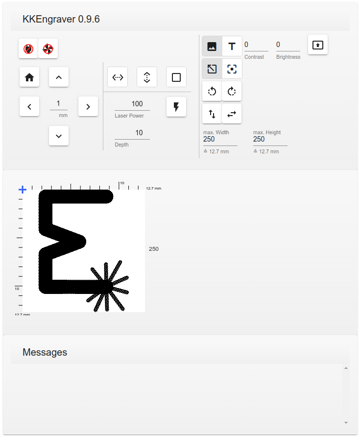
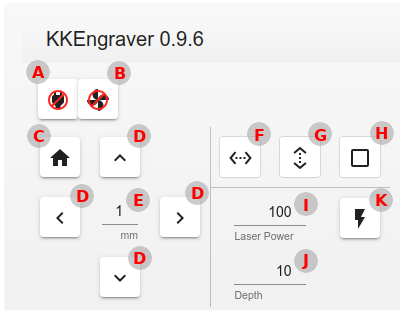
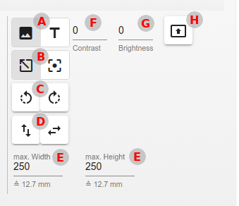

# Description of the engraver software

This software is intended to be used with a KKMoon laser engraver (3000mW).
It comes with ABSOLUTELY NO WARRANTY. It may or may not work with an other kind of
laser engraver.

## Preliminaries

The program is written in python (V3) and uses the python packages 'pyserial' and
'Pillow' (former PIL). So you have get them installed first. 

This software comes in two parts:

`engraver.py` is a command line tool without any GUI. But it has (nearly) every
feature the Windows software that came with the engraver has.

`gui.py` is a graphical user interface implemented as a web frontend. It runs
in a browser tab/window.

## CLI engraver.py

You can get a short help by just typing: `python3 engraver.py -h` or `./engraver.py -h`
if you have made it executable.

    usage: engraver.py [-h] [-d device] [-s speed] [-v] [--fan] [--no-fan]
                       [-m x:y] [-f x:y] [-F imagefile] [-c x|y] [-H] [-C]
                       [-D depth] [-P power] [--checkerboard tile_size number]
                       [-i imagefile] [--contrast number] [--brightness number]
                       [-t text] [--font font]
                       [-T cw|ccw|turn|tb|lr [cw|ccw|turn|tb|lr ...]] [-S w:h]
                       [--invert] [--limit steps] [--dry-run [imagefile]]
    
    Engraver program for using a KKMoon laser engraver V0.9.7 (c) 2019 by Bernd
    Breitenbach This program comes with ABSOLUTELY NO WARRANTY. This is free
    software, and you are welcome to redistribute it under certain conditions; See
    COPYING for details.
    
    optional arguments:
      -h, --help            show this help message and exit
      -d device, --device device
                            the serial device (default: /dev/ttyUSB0)
      -s speed, --speed speed
                            the speed of the serial device (default: 115200)
      -v, --verbosity       increase verbosity level (default: 0)
      --fan                 switch fan on (default: None)
      --no-fan              switch fan off (default: None)
      -m x:y                move the laser x/y steps (default: None)
      -f x:y                draw a moving frame (default: None)
      -F imagefile, --image-frame imagefile
                            draw a moving frame as large as the given image
                            (default: None)
      -c x|y, --center-only x|y
                            draw a center line only (x or y) with the other
                            dimension taken from an image. Has an effect only when
                            used with the -F option (default: None)
      -H, --home            move the laser to pos 0/0 (default: False)
      -C, --center-reference
                            use the current laser postion as reference point for
                            the center of the image or text to engrave; usually it
                            will be the top-left of the image (default: False)
      -D depth, --depth depth
                            set the burn depth of the laser (0-100) (default: 10)
      -P power, --power power
                            set the laser power (0-100) (default: 100)
      --checkerboard tile_size number
                            engrave a quadratic checkerboard pattern of given tile
                            size and number (default: None)
      -i imagefile, --image imagefile
                            the image file to engrave (default: None)
      --contrast number     adjust the contrast of the image (-10..10) (default:
                            None)
      --brightness number   adjust the brightness of the image (-10..10) (default:
                            None)
      -t text, --text text  the text to engrave; you also have to specify a font
                            with the --font option (default: None)
      --font font           the truetype/opentype font used to engrave text
                            (default: None)
      -T cw|ccw|turn|tb|lr [cw|ccw|turn|tb|lr ...], --transform cw|ccw|turn|tb|lr [cw|ccw|turn|tb|lr ...]
                            transform the image after any other operation just
                            before engraving. The following transformations are
                            possible: cw - rotate 90 degrees clockwise; ccw -
                            rotate 90 degrees counterclockwise; turn - rotate 180
                            degrees ; tb - flip top-bottom ; lr - flip left-right
                            (default: None)
      -S w:h, --maxsize w:h
                            scale the image down to match maximal width and
                            height; the aspect ratio is kept (default: None)
      --invert              invert the image/text before engraving (default:
                            False)
      --limit steps         set maximum no. of steps in x/y direction (default:
                            1575)
      --dry-run [imagefile]
                            do not engrave anything; you can specify an optional
                            file for saving engraving data (default: None)
    
    All distances and sizes can be specified in steps or millimeter by just adding
    mm to a given number. The KKMoon engraver has a resolution of 500 steps/inch
    (19.685.. steps/mm)
    
    
Before sending any commands to the KKMoon engraver you have to power it up and connect
it to the computer. Depending on your OS you may have to install a driver for the serial device.

Under Linux you can check whether the device is recognized by looking at the output of `dmesg`.
You should see something like this:

    [1172392.928109] usb 3-5: new full-speed USB device number 16 using xhci_hcd
    [1172393.057149] usb 3-5: New USB device found, idVendor=1a86, idProduct=7523
    [1172393.057152] usb 3-5: New USB device strings: Mfr=0, Product=2, SerialNumber=0
    [1172393.057154] usb 3-5: Product: USB2.0-Serial
    [1172393.057681] ch341 3-5:1.0: ch341-uart converter detected
    [1172393.061184] usb 3-5: ch341-uart converter now attached to ttyUSB0

The last line shows the here the name of our device: `ttyUSB0`.
This device has to be specified with the `-d` option. The KKMoon normally
works with 115200 baud so you don't have the specify the speed.

### First test

To check whether the engraver gets detected just enter (if using a Windows OS you may have to replace `/dev/ttyUSB0`
with your port name e.g. `COM3`):

    ./engraver.py -d /dev/ttyUSB0 -v

The `-v` increases the verbosity and you should see something like this:

    [DEBUG]: opening device /dev/ttyUSB0
    [DEBUG]: connecting...
    [DEBUG]: sending:[10, 0, 4, 0, 255, 0, 4, 0]
    [DEBUG]: got acknowledge
    [DEBUG]: ...connected
    
This indicates that the engraver is regcognized and you can try some other commands.
If you get an error message like this:

    [DEBUG]: opening device /dev/ttyUSB0
    [FATAL]: [Errno 2] could not open port /dev/ttyUSB0: [Errno 2] No such file or directory: '/dev/ttyUSB0'

then the serial device ist not present (perhaps a connection problem).
If you got something like this (after a timeout):

    [DEBUG]: opening device /dev/ttyUSB0
    [DEBUG]: connecting...
    [DEBUG]: sending:[10, 0, 4, 0, 255, 0, 4, 0]
    [FATAL]: didn't got acknowledge; got:b''

then the serial device is present, but the KKMoon engraver could not be detected.
Perhaps due to another model or other firmware.

### Commands

If the above things worked fine. We can now try some commands.

#### The fan

The case fan of the KKMoon can be switched on/off with the `--fan/--no-fan` option.
If not given the state of the fan will remain unchanged.
The cooling fan on the laser head is always on and can not be switched off with this option.

#### Moving the laser

By entering `./engraver.py -v -m 10:10 -d /dev/ttyUSB0` the laser will move by a small amount.
You see this output:

    [DEBUG]: opening device /dev/ttyUSB0
    [DEBUG]: connecting...
    [DEBUG]: sending:[10, 0, 4, 0, 255, 0, 4, 0]
    [DEBUG]: got acknowledge
    [DEBUG]: ...connected
    [DEBUG]: start moving delta_x=10px (0.5mm) delta_y=10px (0.5mm)
    [DEBUG]: sending:[1, 0, 7, 0, 10, 0, 10]
    [DEBUG]: got acknowledge
    [DEBUG]: move finished
    laser moved x:10px (0.5mm) delta_y=10px (0.5mm)

It shows that the laser got moved roughly 0.5 millimeters in x and y direction.
You can revert this movement by entering: `./engraver.py -v -m -10:-10 -d /dev/ttyUSB0`
(Due to a bug in an old version of the python argsparse package it can happen, that
the negative values aren't regcognized correctly. You can get around this bug by
modifying the command slightly:  `./engraver.py -v -m ' -10:-10' -d /dev/ttyUSB0`)

You also can specify the distance in millimeters instead of pixels/steps by adding
mm to the value.
The command `./engraver.py -v -m 7.5mm:3.5mm -d /dev/ttyUSB0` will move the laser
7.5 millimeters in x and 3.5mm in y direction.

You can also leave out the value for x- or y-direction:

`./engraver.py -v -m :7mm -d /dev/ttyUSB0` will only move the laser 7mm in y-direction

and `./engraver.py -v -m ' -4mm' -d /dev/ttyUSB0` will only move the laser -4mm in x-direction

#### Depth and power

With the two parameters depth (-D) and power (-P) you can adjust the final look of the engraving.
When increasing the depth parameter the laser moves more slowly and stays longer at the same point.
This results in removing more material and a deeper engraving. 
Lowering the power results in a weaker laser beam. I assume the laser is controlled through PWM and so the
on-time during a cycle is probably decreased.

#### Home

You can move the laser to the home position (0,0) with the `-H` option. But be careful
the KKMoon has no endswitches and the firmware will drive both stepper motors the full distance
(89mm) towards the origin. So they eventually will hit the case.

#### Showing a moving frame

As the original software does you can also show a moving frame to align the workpiece
before doing the engraving.
Enter `./engraver.py -v -f 25mm:10mm -d /dev/ttyUSB0` and you see the laser repetitive
drawing a frame until you hit the return key. 

You can also use your image file you want to engrave to show a frame. Just enter
`./engraver.py -F <yourimage> -d /dev/ttyUSB0` and you will an output like this

    showing frame x:283px (14.4mm) y:309px (15.7mm)
    press return to finish

After pressing the return key. The laser will complete the current frame until it reaches
the origin of the frame.
As an image format you can use all formats the Pillow (PIL) package support (e.g. jpg/png/gif).

It is also possible to restrict the frame to the x- or y-axis by using the `-c` option:

`./engraver.py -c x -F <yourimage> -d /dev/ttyUSB0`

will show a line in x direction in the middle of the y size of the image.

#### Engraving

The program contains a function to engrave a checkerboard pattern as a test. For example
if you enter: `./engraver.py --checkerboard 4mm 4 -d /dev/ttyUSB0` it will engrave a checkboard
pattern 4 by 4 with a tile size of 4mm. It will take a while and you see some output:

    waiting for engraver
    sending data (312 rows) ...
    100% done
    engraving...
    completed!

It will engrave the pattern with the default values for engravement depth (10) and laser power
(100). Both values can be changed between 0 and 100.

Instead of the test pattern you can specify your image file:

`./engraver.py -i <yourimage> -D 15 -d /dev/ttyUSB0`

or with a given maximum size by keeping the aspect ratio:

`./engraver.py -i <yourimage> -S 5mm:5mm -D 15 -d /dev/ttyUSB0`

You see an output like this:

    image resized to width:89px (4.5mm) height:98px (5.0mm)
    preparing image data width:89px (4.5mm) height:98px (5.0mm)
    waiting for engraver
    sending data (98 rows) ...
    100% done
    engraving...
    completed!

Note: you only can shrink your image you cannot enlarge it with this option.

#### Engraving text

With the `-t` and the `--font` options you can engrave a text with a given font. Here the `-S` option
is very useful for setting the maximum height or width of the engraving.
With the `--font` you have to specify a TrueType or OpenType font file. 

The command `./engraver.py -t "Hello!" --font fonts/arial.ttf -S 25mm:10mm -d /dev/ttyUSB0`
engraves the word 'Hello' using the font arial.ttf in the subdirectory fonts and
with the maximal dimensions of 25mm in x direction and 10mm in y direction.

I do not provide any fonts with this program. You can find a lot by searching the internet
for 'open source fonts' or using one of those already installed on your OS.

#### Transform 

With the `-T` option you can rotate and/or mirror your image or text before engraving after any other operation.
You can specify multiple transformation after the option e.g:

`./engraver.py -t "Hello!" --font fonts/arial.ttf -T cw tb -S 25mm:10mm -D 15 -d /dev/ttyUSB0`

first rotates the text clockwise and afterwards mirrors it about the y axis (flips top-bottom).

Note: the scaling with `-S` happens *before* tranforming. So in the above example 25mm is the maximal length of
the text image and 10mm its maximal height.

#### Contrast & Brightness

You can specify contrast and brightness adjustments for an image between -10 and 10.
Positive values increase contrast/brightness. Negative values decreases them.

Note: these values only makes sense if the original image is of a multicolor or grayscale type.
If you use a black/white image they are useless.

Finally the image always gets converted to a black/white image by dithering, because the engraver
can not handle grayscale values.

#### Dry run

With the `--dry-run` option you can test options without sending any commands to the device. It does not even has
to be connected to the computer.

If a file name is specified with this option and an image or text should be engraved the final image will be saved
to that file.

### Emergency

If something go wrong during engraving, hit the interrupt key (Ctrl-c) and the engraving
will pause. You can abort the process now by hitting the return key or continue it by
entering `n` followed by a return.

## GUI

The graphical user interface can be started by entering `./gui.py`. You can get a help by adding `-h`:

    usage: gui.py [-h] [-d device] [-s speed] [-v] [--limit steps] [-b browser]
                  [-B bind] [-P port]
    
    Engraver program for using a KKMoon laser engraver V0.9.7 (c) 2019 by Bernd
    Breitenbach This program comes with ABSOLUTELY NO WARRANTY. This is free
    software, and you are welcome to redistribute it under certain conditions; See
    COPYING for details.
    
    optional arguments:
      -h, --help            show this help message and exit
      -d device, --device device
                            the serial device (default: /dev/ttyUSB0)
      -s speed, --speed speed
                            the speed of the serial device (default: 115200)
      -v, --verbosity       increase verbosity level (default: 0)
      --limit steps         set maximum no. of steps in x/y direction (default:
                            1575)
      -b browser, --browser browser
                            use browser to open gui, set to - to not open the gui
                            (default: )
      -B bind, --bind bind  use the given address to bind to; use 0.0.0.0 for all
                            interfaces (default: 127.0.0.1)
      -P port, --port port  use the given port (default: 8008)

The GUI has fewer options. You can specify most parameters in the GUI itself.
The first options are identical to the corresponding ones of `engraver.py`. The last three
are for specifying the browser, the address and the port for the web server.
If the `-b` option is ommited the gui is opened in the users default browser.
You can specify other browsers by their name. The gui was tested with `firefox` and `chromium-browser`.
By using `-` behind the browser option the gui is not opened automatically.
By default the web server for the gui is only bound to `127.0.0.1` (localhost) so it can only
used from the same computer. If you bind it to `0.0.0.0` any computer in the same network can
control the gui of the engraver. The default port is `8008`. You can change it with the `-P` option.

After starting `gui.py` your default browser should show a new window/tab with the GUI.
Here you can see the screen opened with the chromium browser.

In the top section you can see many buttons to control the engraver:

### Engraver settings

A. You can connect/disconnect to the engraver. If not connected most of the
   buttons are disabled.

B. Here you can switch on/off the engraverfan

C. Move the laser to the home position

D. Move the laser in the given direction

E. The length the laser is moved by the direction buttons [D] (0.1-10mm)

F. Show a preview line of the horizontal engraving dimension

G. Show a preview line of the vertical engraving dimension 

H. Show a preview frame of the engraving dimensions

I. Specify the laser power (1-100)

J. Specify the engraving depth (1-100)

K. Start the engraving. If pressed, most buttons are disabled until the
   engraving process is finished or canceled.

### Image settings

A. Switch between image and text mode

B. Toggle the reference point for engraving between top-left (default)
   and center. If center is selected the image will be engraved symmetrically
   around the center point.

C. Rotate the image counter-clockwise respectivly clockwise

D. Flip the image horizontally respectivly vertically

E. Here you can specify the maximum width respectivly height of the image.
   The aspect ratio of the image is always kept. So mostly only one of the
   values restrict the size of the image. Note: you cannot enlarge an image beyond
   its give size by entering large values. Normally you enter the size in pixel
   value but you can type 'mm' after the number and the it is taken as
   a mm-value and converted to the correct pixel value.

F. Enter a contrast value (-10..10) 0 means no change.

G. Enter a brightness value (-10..10) 0 means no change.

Note: only color or grayscale images are affected by contrast/brightness settings

H. Upload an image to engrave

### Text settings

A. Enter your text to engrave

B. Select a font from the ones residing in the `fonts` directory.
   You can copy any truetype font into this directory.

## Supported models

Currently this software is tested and works with a KKMoon 3000 (3 Watts power). 
It may or may not work with other models from KKMoon.

    
